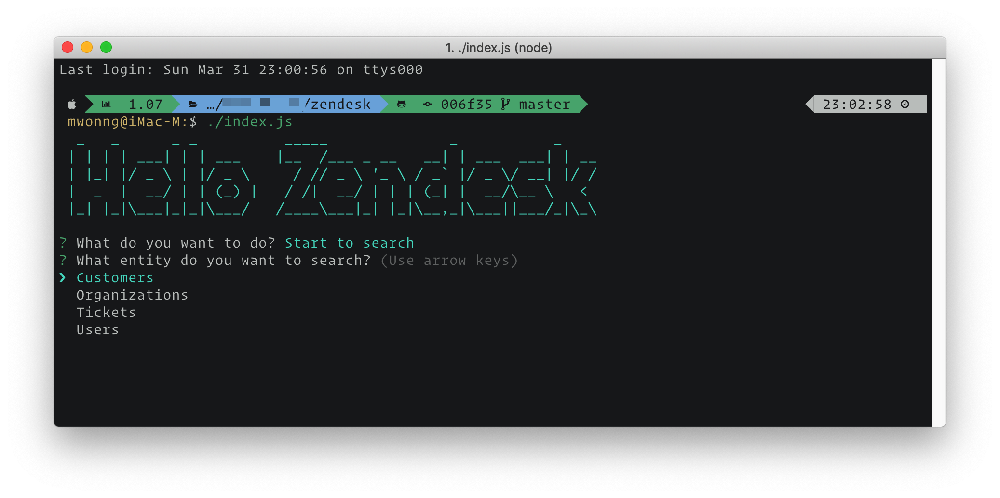

## Summary
simulate search

## Screebshot

## Requirement

node >= 10,
npm or yarn installed

## How to run
`./index.js` or `node index.js`

## Setting

- `SEARCH_RESULT_PER_PAGE`: how many results on every page, default as 5
- `RES_TYPE`: search response/source type, `remote` or `local`. `remote` will fetch response from API, `local` will get response from local json file

- `DATA_FOLDER`: if choose `RES_TYPE` set as `local`, this folder is the location for all json data.
- `REMOTE_END_POINT`: API Endpoint
- `FETCH_ENTITIES`: API to get all entities result.

## Production / Build

`npm run build` or `yarn build`

## Test

`npm run test` or `yarn test`

## How to add more local entities

put your json file into `datasource/` folder

## How to switch to fetch remote data

*customize the request url to match your own response*

for any search, you have three params to send in `findRemote(entity, field, keyword` in `./src/SearchService.js`

- entity : the entity you are looking for search
- field : the field you are looking for search
- keyword : the value match your keyword.
