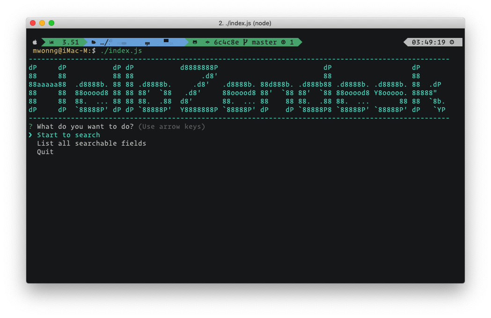

## Summary
simulate search within given data.

## Screebshot



## Feature
- auto load data from folder.
- show related info via schema.
- results pagenate.
- cached index for search results.
- notification if field not exists before search.
- search can match if field is array.
- search using empty value for records which doesn't have that attribute.

## Requirement
- node >= 10,
- npm or yarn installed

## How to run

### Develop
`npm install` or `yarn` to install dependencies

and

`./index.js` or `node index.js` to run this CLI

### Production
ONLY for build to a excutable CLI on MacOS, Linux or Windows, Note: **you can not add any datasource after build**

`npm run build` or `yarn build`

and

- `./release/index-macos` if you run on MacOS
- `./release/index-linux` if you run on Linux
- `./release/index-win.exe` if you run on Windows

## Test
`npm run test` or `yarn test`


## Setting
- `SEARCH_RESULT_PER_PAGE`: how many results on every page, default as 5
- `DATA_FOLDER`: this folder is the location for store all json data.
- `SCHEMA_FOLDER`: schema setting folder

### Schema setting

Usually, evey entity has two way of relationship: belongsTo and hasMany.

For example,

``` javascript
  {
    'entity'            : 'users',
    'entity_field'      : 'name',
    'toEntity'          : 'organizations',
    'toEntity_field'    : 'name',
    'foreign_key_name'  : 'organization_id',
    'field_on_entity'   : 'users_organization',
    'field_on_toEntity' : 'organization_users'
  },
```

in this setting, users are belongs to organizations, and organizations has many users, the setting shows the relationship bwteen these two entities.

_Note: you don't have to set twice for two way relationship, it will auto revert the relationship_

- `entity` : entity name starts from, which was **hasMany** entity
- `entity_field` : the field on value connect to organization if search organization entity, should showing organization_users value, the value comes from this field on user
- `toEntity` : destination entity name, which was **belongsTo** entity
- `toEntity_field` : the field on value connect to user if search user entity, it will show users_organazation value, the value comes from this field on organazation
- `foreign_key_name` : usually foreign key was on **hasMany** entity which matching **belongsTo** entity's primary key.
- `field_on_entity` : when data joined, the attribute/field name shows on  **hasMany** entity users
- `field_on_toEntity` : when data joined, the attribute/field name shows on  **belongsTo** entity users, this usually be an array.

## How to add more local entities
1. put your **json** file into `datasource/` folder
2. add schema for your own data

## improvement
- entity field can be a list or autocompelete
- entity fields can be cached
